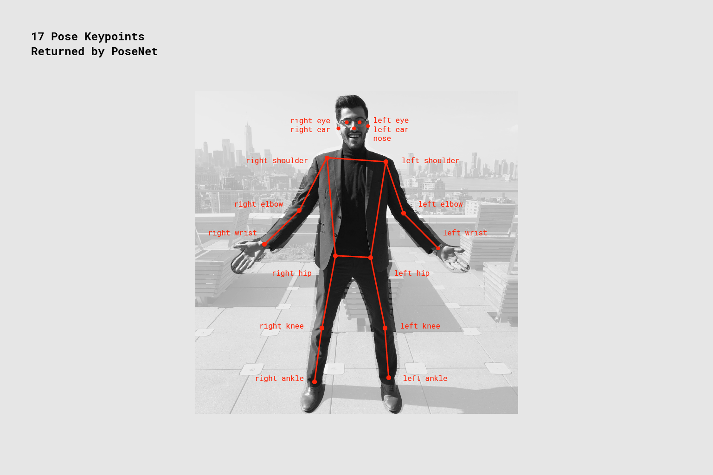

# PoseNet: Webcam & Image Upload Pose Estimation with ml5.js

A browser-based pose estimation tool built with [ml5.js](https://ml5js.org/) and [p5.js](https://p5js.org/). It uses the PoseNet model to detect and visualize human body keypoints and skeletons in real time via webcam, or from any uploaded image.
Ref: [tensorflow.org](https://blog.tensorflow.or)



## 🚀 Features

- 🔴 **Real-time pose estimation** via webcam.
- 🖼️ **Image upload support** for pose detection on static images.
- 🎯 Detects body parts with keypoints and connects them with skeleton lines.
- ⚡ No backend required — runs fully in the browser.
- 🧠 Built with PoseNet via ml5.js — beginner-friendly and easy to extend.

## 💡 Use Cases

- Fitness or dance feedback apps
- Educational tools to explain human movement
- Motion tracking in browser-based games
- Interactive installations using body pose
- Prototyping gesture-based UI ideas

## 🛠️ How to Use

1. Clone the repository:

```bash
git clone https://github.com/yourusername/posenet-webcam-image-ml5.git
cd posenet-webcam-image-ml5
